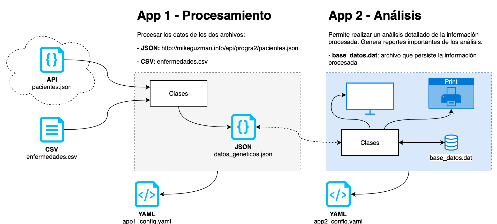
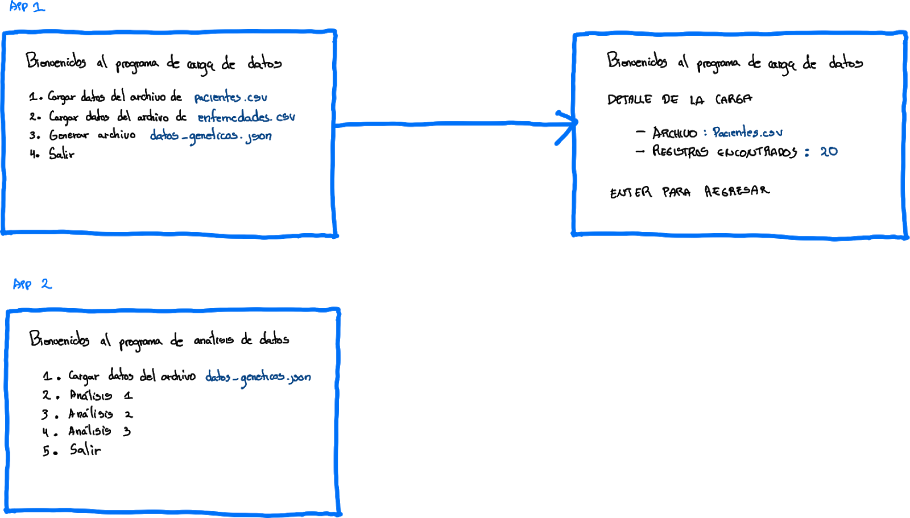

# PROYECTO 2

| UNIVERSIDAD NACIONAL   | ESCUELA DE INFORMÁTICA                          |
| ---------------------- | ----------------------------------------------- |
| EIF 204 PROGRAMACIÓN 2 | EJERCICIO DE CÁTEDRA N° 2                       |
| FECHA DE ENTREGA:      | SEMANA 14 (Domingo, 14 de Noviembre. 2021)      |
| PUNTAJE TOTAL:         | 100 Puntos                                      |
| PORCENTAJE:            | Corresponde a un 20% de la nota final del curso |

## CONDICIONES DEL PROYECTO

El Proyecto de Aprendizaje del curso EIF 204 Programación 2 pretende que el estudiante ponga en práctica los siguientes temas:

* Programación Genérica
* Archivos binarios y de texto
  * Serialización y deserialización
  * Flujo de datos
  * Configuración
* Principios de diseño
  * Patrones Creacionales
  * Patrones Estructurales
  * Patrones de Comportamiento

Se presenta un problema que el estudiante debe implementar en el IDE seleccionado por el profesor para desarrollar un proyecto en C++, y posteriormente subirlo al aula virtual o en el repositorio en GitHub en la sección que el profesor habilite para esto. El ejercicio se trabaja en grupos. Cualquier plagio se calificará con 0, como lo establece el artículo 24 del Reglamento General sobre los procesos de Enseñanza y Aprendizaje de la Universidad Nacional.

## TEMAS EVALUADOS:

1. Estándares de programación
2. Manejo de errores
3. Archivos de texto y binarios
   * Serialización y deserialización de objetos
4. Programación genérica
5. Principios de diseño
   * Patrones de diseño creacionales
   * Patrones de diseño estructurales
   * Patrones de diseño de comportamiento

## ENUNCIADO DEL PROBLEMA

La Universidad Nacional de Costa Rica en conjunto con la Escuela de Ciencias Biológicas y la Escuela de Informática, está desarrollando un proyecto de software para identificar la susceptibilidad de pacientes de contraer ciertas enfermedades de carácter genético. Para esto es necesario comparar la huella genética de cada paciente (extracto de ADN) contra secuencias de ADN previamente identificadas que caracterizan cada una de las enfermedades.

El material genético se compone de cuatro bases nitrogenadas distintas, que tienen una representación mediante letras en el código genético: adenina (A), timina (T), guanina (G) y citosina (C) en el ADN. En el contexto computacional, una hilera de ADN se podría modelar con el tipo de datos de hilera. Así, por ejemplo, la secuencia de caracteres “TGAAAAGAGAGTCTG” es una secuencia de ADN válida.

Para este proyecto, cuenta con datos que describen a un conjunto de pacientes y una lista de enfermedades. A continuación se detallan los datos, las aplicaciones que deberá de crear y la funcionalidad requerida.

La Escuela de Informática ha establecido desarrollar dos aplicaciones en C++. El diseño de las aplicaciones y su funcionamiento se detalla a continuación:

### Aplicación de Procesamiento

Tiene las siguientes funciones:

1. Procesar los datos de dos fuentes de texto. La primera de un archivo de tipo JSON  y la segunda con datos de tipo CSV (valores separados por comas).
   * **pacientes.json**, el contenido se encuentra en un archivo de texto formateados en JSON, el cual contiene una lista de pacientes. Para cada paciente se describen sus datos personales y se tiene un extracto del ADN del mismo.
   * **enfermedades.csv**, este es un archivo de texto de tipo CSV, que contiene una lista de enfermedades cada una caracterizada por una secuencia de ADN marcadora.

2. Agrupar y serializar la información en un único archivo de texto de tipo JSON (JavaScript Object Notation) denominado **datos_geneticos.json,** cuyo objetivo es almacenar la información estructurada y procesada para el intercambio de datos con la segunda aplicación de análisis.
   * Dicho archivo en formato **.json** deberá tener toda la información de los pacientes proveniente del archivo **pacientes.json** en la nube. Además, cada paciente deberá tener una lista de todas las enfermedades para las cuales tenga una predisposición genética. Esta última información deberá ser calculada y añadida como parte del procesamiento.
   * En el contexto actual, se dice que un paciente tiene predisposición a contraer una enfermedad si dentro del extracto de ADN del paciente se encuentra la secuencia marcadora de la enfermedad.

### Aplicación de Análisis

Tiene las siguientes funciones:

1. Tiene la función de deserializar la información del archivo **datos_geneticos.json** y almacenar esa información en un archivo binario denominado **base_datos.dat** para persistir los datos y analizarla posteriormente.
2. Permite efectuar diferentes tipos de análisis con la información almacenada en el archivo binario **base_datos.dat**:
   * **Análisis #1:** Crear un reporte con todas las enfermedades que muestre para cada una los pacientes que tienen susceptibilidad de tenerla. Las enfermedades deben mostrarse ordenadas de mayor a menor incidencia.
   * **Análisis #2:** Se debe mostrar la lista de pacientes y poder consultar para cada uno (según seleccione el usuario) la concentración de cada base nitrogenada en términos porcentuales. Por ejemplo: A - %24, T - 22%, G - 50%, C - 4%.
   * **Análisis #3**: Las secuencias también trabajan entre sí, por lo que si un paciente tiene más susceptibilidades, aumenta el riesgo de que se desarrollen dichas enfermedades, por lo que se debe generar un reporte con la lista de pacientes y el nombre de las enfermedades a las cuales son susceptibles. Se debe mostrar: 2 concordancias indican una posibilidad de 35%, mientras que 3 o más concordancias indican un 65% de probabilidad que el paciente desarrolle dichas condiciones de salud.

## Aspectos técnicos

- La **App 1**, debe de leer los datos del JSON. 
- Es necesario tener archivos de configuración de formato YAML (**YAML** Ain't Markup Language) con el fin de ubicar elementos de configuración para simplificar ambas aplicaciones (**App1** y **App2**), un ejemplo sería la ubicación física de los archivos **datos_geneticos.json**,  **base_datos.dat**, entre otros. Los nombres son: **app1_config.yaml** y **app2_config.yaml**. Para tener acceso a los mismos se podrian usar librerias externas, por ejemplo: https://github.com/jbeder/yaml-cpp/wiki/Tutorial  

## Pantallas de la aplicación

| Detalle                                                      | Puntaje |
| ------------------------------------------------------------ | ------- |
| **[ESTÁNDARES]** Código fuente ordenado siguiendo los estándares definidos para los nombres de las variables, archivos y estructura de las clases. | 5       |
| **[UML]** Diagrama de clases de ambas aplicaciones. (3 puntos cada una) | 6       |
| **[ARCHIVOS]** Definición correcta de los archivos de configuracion en YAML (3 puntos) | 3       |
| **[ARCHIVOS]** Procesamiento correcto del archivo CSV y consumo de los datos directamente en la nube en formato JSON. (5 puntos cada uno) | 10      |
| **[FLUJO DATOS]** Serialización (5 puntos) y deserialización (5 puntos) de las estructuras de datos en el archivo **datos_geneticos.json**. | 10      |
| **[ARCHIVOS]** Almacenamiento (3 puntos) y lectura (3 puntos) de la información en el archivo binario. | 6       |
| **[MANEJO DE ERRORES]** Uso correcto de las excepciones y el try catch. | 5       |
| **[TEMPLATES]** Implementación de programación genérica. Los estudiantes deben argumentar con criterios técnicos el uso de la programación genérica. | 5       |
| **[PATRONES DE DISEÑO]** Los estudiantes deben argumentar con criterios técnicos la utilización de patrones de diseño y su respectiva implementación. Queda a criterio del profesor el cómo evaluar este rubro. | 30      |
| **[PRUEBAS DE UNIDAD]** Ejecutar las pruebas necesarias para evaluar los resultados y funcionalidad de ambas aplicaciones. | 20      |
